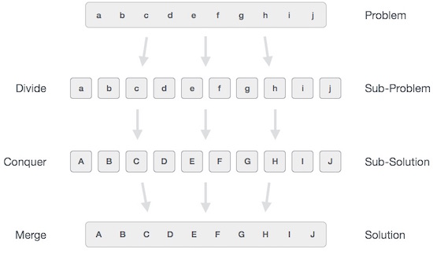
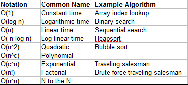
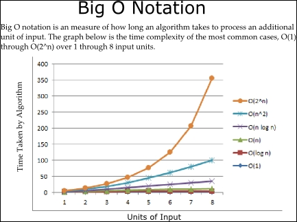

# Algorithms

Algorithm is a step-by-step procedure, which defines a set of instructions to be executed in a certain order to get the desired output.

## Categories

From the data structure point of view, following are some important categories of algorithms:

**Search** − Algorithm to search an item in a data structure.

**Sort** − Algorithm to sort items in a certain order.

**Insert** − Algorithm to insert item in a data structure.

**Update** − Algorithm to update an existing item in a data structure.

**Delete** − Algorithm to delete an existing item from a data structure.

## Algorithm Complexity

Suppose X is an algorithm and n is the size of input data, the time and space used by the algorithm X are the two main factors, which decide the efficiency of X.

**Time Factor** − Time is measured by counting the number of key operations such as comparisons in the sorting algorithm.

**Space Factor** − Space is measured by counting the maximum memory space required by the algorithm.

The complexity of an algorithm f(n) gives the running time and/or the storage space required by the algorithm in terms of n as the size of input data.

### Space Complexity

Space complexity of an algorithm represents the amount of memory space required by the algorithm in its life cycle. The space required by an algorithm is equal to the sum of the following two components −

A fixed part that is a space required to store certain data and variables, that are independent of the size of the problem. For example, simple variables and constants used, program size, etc.

A variable part is a space required by variables, whose size depends on the size of the problem. For example, dynamic memory allocation, recursion stack space, etc.

Space complexity S(P) of any algorithm P is S(P) = C + SP(I), where C is the fixed part and S(I) is the variable part of the algorithm, which depends on instance characteristic I. Following is a simple example that tries to explain the concept −

Algorithm: SUM(A, B)
Step 1 -  START
Step 2 -  C ← A + B + 10
Step 3 -  Stop
Here we have three variables A, B, and C and one constant. Hence S(P) = 1 + 3. Now, space depends on data types of given variables and constant types and it will be multiplied accordingly.

### Time Complexity

Time complexity of an algorithm represents the amount of time required by the algorithm to run to completion. Time requirements can be defined as a numerical function T(n), where T(n) can be measured as the number of steps, provided each step consumes constant time.

For example, addition of two n-bit integers takes n steps. Consequently, the total computational time is T(n) = c ∗ n, where c is the time taken for the addition of two bits. Here, we observe that T(n) grows linearly as the input size increases.

## Greedy Algorithms

An algorithm is designed to achieve optimum solution for a given problem. In greedy algorithm approach, decisions are made from the given solution domain. As being greedy, the closest solution that seems to provide an optimum solution is chosen.

Greedy algorithms try to find a localized optimum solution, which may eventually lead to globally optimized solutions. However, generally greedy algorithms do not provide globally optimized solutions.

### Counting Coins

This problem is to count to a desired value by choosing the least possible coins and the greedy approach forces the algorithm to pick the largest possible coin. If we are provided coins of ₹ 1, 2, 5 and 10 and we are asked to count ₹ 18 then the greedy procedure will be −

1 − Select one ₹ 10 coin, the remaining count is 8

2 − Then select one ₹ 5 coin, the remaining count is 3

3 − Then select one ₹ 2 coin, the remaining count is 1

4 − And finally, the selection of one ₹ 1 coins solves the problem

Though, it seems to be working fine, for this count we need to pick only 4 coins. But if we slightly change the problem then the same approach may not be able to produce the same optimum result.

For the currency system, where we have coins of 1, 7, 10 value, counting coins for value 18 will be absolutely optimum but for count like 15, it may use more coins than necessary. For example, the greedy approach will use 10 + 1 + 1 + 1 + 1 + 1, total 6 coins. Whereas the same problem could be solved by using only 3 coins (7 + 7 + 1)

Hence, we may conclude that the greedy approach picks an immediate optimized solution and may fail where global optimization is a major concern.

### Examples
Most networking algorithms use the greedy approach. Here is a list of few of them −

* [Travelling Salesman Problem](travelling_salesman.py)
* Prim's Minimal Spanning Tree Algorithm
* Kruskal's Minimal Spanning Tree Algorithm
* [Dijkstra's Minimal Spanning Tree Algorithm](dijkstras.py)
* Graph - Map Coloring
* Graph - Vertex Cover
* [Knapsack Problem](knapsack.py)
* Job Scheduling Problem

## Divide and Conquer

In divide and conquer approach, the problem in hand, is divided into smaller sub-problems and then each problem is solved independently. When we keep on dividing the subproblems into even smaller sub-problems, we may eventually reach a stage where no more division is possible. Those "atomic" smallest possible sub-problem (fractions) are solved. The solution of all sub-problems is finally merged in order to obtain the solution of an original problem.

Broadly, we can understand divide-and-conquer approach in a three-step process.

### Divide/Break
This step involves breaking the problem into smaller sub-problems. Sub-problems should represent a part of the original problem. This step generally takes a recursive approach to divide the problem until no sub-problem is further divisible. At this stage, sub-problems become atomic in nature but still represent some part of the actual problem.

### Conquer/Solve
This step receives a lot of smaller sub-problems to be solved. Generally, at this level, the problems are considered 'solved' on their own.

### Merge/Combine
When the smaller sub-problems are solved, this stage recursively combines them until they formulate a solution of the original problem. This algorithmic approach works recursively and conquer & merge steps works so close that they appear as one.

### Examples
The following computer algorithms are based on divide-and-conquer programming approach −

* Merge Sort
* Quick Sort
* [Binary Search](binary_search.py)
* Strassen's Matrix Multiplication
Closest pair (points)

## Dynamic programming

This approach is similar to divide and conquer in breaking down the problem into smaller and yet smaller possible sub-problems. But unlike, divide and conquer, these sub-problems are not solved independently. Rather, results of these smaller sub-problems are remembered and used for similar or overlapping sub-problems.

Dynamic programming is used where we have problems, which can be divided into similar sub-problems, so that their results can be re-used. Mostly, these algorithms are used for optimization. Before solving the in-hand sub-problem, dynamic algorithm will try to examine the results of the previously solved sub-problems. The solutions of sub-problems are combined in order to achieve the best solution.

So we can say that −

* The problem should be able to be divided into smaller overlapping sub-problem.

* An optimum solution can be achieved by using an optimum solution of smaller sub-problems.

* Dynamic algorithms use Memoization.

### Comparison
In contrast to greedy algorithms, where local optimization is addressed, dynamic algorithms are motivated for an overall optimization of the problem.

In contrast to divide and conquer algorithms, where solutions are combined to achieve an overall solution, dynamic algorithms use the output of a smaller sub-problem and then try to optimize a bigger sub-problem. Dynamic algorithms use Memoization to remember the output of already solved sub-problems.

### Example
The following computer problems can be solved using dynamic programming approach −

* Fibonacci number series
* Knapsack problem
* Tower of Hanoi
* All pair shortest path by Floyd-Warshall
* [Shortest path by Dijkstra](shortest_path.py)
* Project scheduling

## Big-O Notation
n: Size of the imputs

---