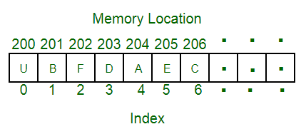
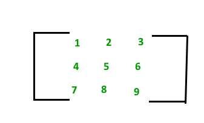
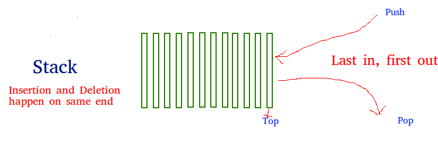
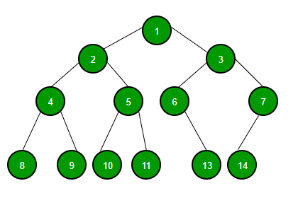
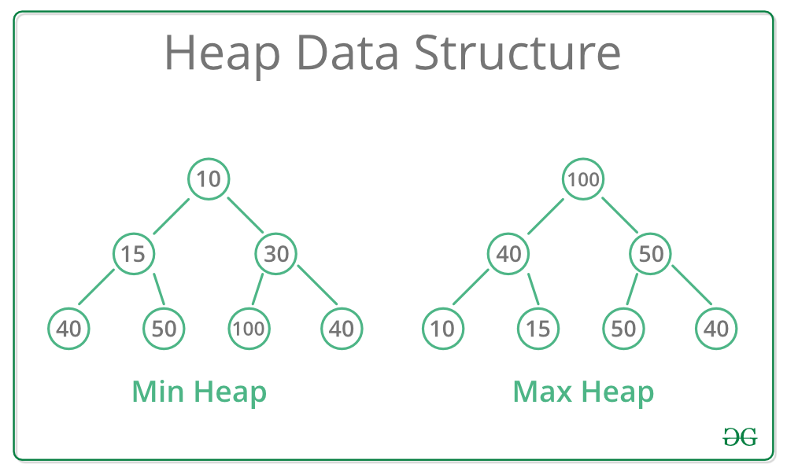
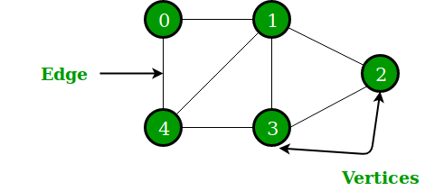

# Data Structures

Data organization, management, and storage format that enables efficient access and modification. More precisely, a data structure is a collection of data values, the relationships among them, and the functions or operations that can be applied to the data.

Data structures serve as the basis for abstract data types (ADT). The ADT defines the logical form of the data type. The data structure implements the physical form of the data type.

**What are linear and non linear data Structures?**

*Linear*: A data structure is said to be linear if its elements form a sequence or a linear list. Examples: Array. Linked List, Stacks and Queues

*Non-Linear*: A data structure is said to be non-linear if traversal of nodes is nonlinear in nature. Example: Graph and Trees.

### Basic Operations

The data in the data structures are processed by certain operations. The particular data structure chosen largely depends on the frequency of the operation that needs to be performed on the data structure.

* Traversing: travel across or through
* Searching
* Insertion
* Deletion
* Sorting
* Merging

## [Array](arrays.py)

Array is a container which can hold a fix number of items and these items should be of the same type, in a specific order. 

*Elements* are accessed using an integer index to specify which element is required. Typical implementations allocate contiguous memory words for the elements of arrays. Arrays may be fixed-length or resizable.

Collection of items stored at contiguous memory locations. 

Array is a data structure used to store homogeneous elements at contiguous locations. Size of an array must be provided before storing data.

*Advantages of using arrays:*

* Arrays allow random access of elements. This makes accessing elements by position faster.
* Arrays have better cache locality that can make a pretty big difference in performance.

### Arrays basic operations

**Traverse** − print all the array elements one by one.

**Insertion** − Adds an element at the given index.

**Deletion** − Deletes an element at the given index.

**Search** − Searches an element using the given index or by the value.

**Update** − Updates an element at the given index.

### Arrays O's
Let size of array be n.

| Operation         | Big-O     |                       |
|---                | ---       | ---                   |
| Accessing Time    | O(1)      | This is possible because elements are stored at contiguous locations |
| Search Time       | O(n)      | for Sequential Search |
| Search Time       | O(log n)  | for Binary Search If Array is sorted |
| Insertion Time    | O(n)      | The worst case occurs when insertion happens at the Beginning of an array and  requires shifting all of the elements |
| Deletion Time     | O(n)      | The worst case occurs when deletion happens at the Beginning of an array and requires shifting all of the elements |

**Example** : For example, let us say, we want to store marks of all students in a class, we can use an array to store them. This helps in reducing the use of number of variables as we don’t need to create a separate variable for marks of every subject. All marks can be accessed by simply traversing the array.

### Arrays in Python

*Python has a set of built-in methods that you can use on lists/arrays.*

| Method    | Description  |
| ---       |  ---         |
| append()  | Adds an element at the end of the list  |
| clear()   | Removes all the elements from the list  |
| copy()    | Returns a copy of the list  |
| count()   | Returns the number of elements with the specified value  |
| extend()  | Add the elements of a list (or any iterable), to the end of the current list |
| index()   |	Returns the index of the first element with the specified value |
| insert()  |	Adds an element at the specified position |
| pop()	    | Removes the element at the specified position |
| remove()	| Removes the first item with the specified value |
| reverse()	| Reverses the order of the list | 
| sort()	  | Sorts the list |

## [Matrix](matrix.py)

A matrix represents a collection of numbers arranged in an order of rows and columns. It is necessary to enclose the elements of a matrix in parentheses or brackets.

Matrix is a special case of two dimensional array where each data element is of strictly same size. So every matrix is also a two dimensional array but not vice versa. Matrices are very important data structures for many mathematical and scientific calculations. As we have already discussed two dimnsional array data structure in the previous chapter we will be focusing on data structure operations specific to matrices in this chapter.

We also be using the numpy package for matrix data manipulation.

## [List](lists.py)

It is similar to array with the exception that the data elements can be of different data types. You can have both numeric and string data in a python list.

## [Tuple](tuples.py)

Tuples are similar to lists but they are immutable which means the values in a tuple cannot be modified they can only be read.

A tuple is a sequence of immutable Python objects. Tuples are sequences, just like lists. The differences between tuples and lists are, the tuples cannot be changed unlike lists and tuples use parentheses, whereas lists use square brackets.

## [Sets](sets.py)

Mathematically a set is a collection of items not in any particular order. A Python set is similar to this mathematical definition with below additional conditions.

* The elements in the set cannot be duplicates.
* The elements in the set are immutable(cannot be modified) but the set as a whole is mutable.
* There is no index attached to any element in a python set. So they do not support any indexing or slicing operation.

#### Set Operations

The sets in python are typically used for mathematical operations like union, intersection, difference and complement etc. 

We can create a set, access it’s elements and carry out these mathematical operations.

## [Maps](maps.py)

Python Maps also called ChainMap is a type of data structure to manage multiple dictionaries together as one unit. The combined dictionary contains the key and value pairs in a specific sequence eliminating any duplicate keys. The best use of ChainMap is to search through multiple dictionaries at a time and get the proper key-value pair mapping. We also see that these ChainMaps behave as stack data structure.

## [Linked list](linked_lists.py)

- A **linked list** is a linear collection of data elements of any type, called nodes, where each node has itself a value, and points to the next node in the linked list. The principal advantage of a linked list over an array, is that values can always be efficiently inserted and removed without relocating the rest of the list. Certain other operations, such as random access to a certain element, are however slower on lists than on arrays.

Python does not have linked lists in its standard library. We implement the concept of linked lists using the concept of nodes as discussed in the previous chapter. We have already seen how we create a node class and how to traverse the elements of a node.

### Types of Linked List:

**Singly Linked List**: In this type of linked list, every node stores address or reference of next node in list and the last node has next address or reference as NULL. 

For example 1->2->3->4->NULL

[**Doubly Linked List**](doubly_linked_list.py): Here, here are two references associated with each node, One of the reference points to the next node and one to the previous node. 
* Doubly Linked List contains a link element called first and last.
* Each link carries a data field(s) and two link fields called next and prev.
* Each link is linked with its next link using its next link.
* Each link is linked with its previous link using its previous link.
* The last link carries a link as null to mark the end of the list.

Eg. NULL<-1<->2<->3->NULL

**Circular Linked List**: Circular linked list is a linked list where all nodes are connected to form a circle. There is no NULL at the end. A circular linked list can be a singly circular linked list or doubly circular linked list. 

Eg. 1->2->3->1 [The next pointer of last node is pointing to the first]

### **How is an Array different from Linked List?**

- The size of the arrays is fixed, Linked Lists are Dynamic in size.
- Inserting and deleting a new element in an array of elements is expensive, Whereas both insertion and deletion can easily be done in Linked Lists.
- Random access is not allowed in Linked Listed.
- Extra memory space for a pointer is required with each element of the Linked list.
- Arrays have better cache locality that can make a pretty big difference in performance.

### Linked lists basic operations

**Insertion** − Adds an element at the beginning of the list.

**Deletion** − Deletes an element at the beginning of the list.

**Display** − Displays the complete list.

**Search** − Searches an element using the given key.

**Delete** − Deletes an element using the given key.

### Linked list O's

| Operation         | Big-O     |                       |
|---                | ---       | ---                   |
| Accessing time of an element    | O(n)      |  |
| Search time of an element       | O(n)      |  |
| Insertion of an Element         | O(1)      | If we are at the position  where we have to insert an element |
| eletion of an Element           | O(1)      | If we know address of node previous the node to be deleted |

**Example** : Consider the previous example where we made an array of marks of student. Now if a new subject is added in the course, its marks also to be added in the array of marks. But the size of the array was fixed and it is already full so it can not add any new element. If we make an array of a size lot more than the number of subjects it is possible that most of the array will remain empty. We reduce the space wastage Linked List is formed which adds a node only when a new element is introduced. Insertions and deletions also become easier with linked list.
One big drawback of linked list is, random access is not allowed. With arrays, we can access i’th element in O(1) time. In linked list, it takes Θ(i) time.

## [Stack](stacks.py)

Stack is a linear data structure which follows a particular order in which the operations are performed. The order may be LIFO(Last In First Out) or FILO(First In Last Out).

### Basic operations of stack

**push**() − Pushing (storing) an element on the stack.

**pop**() − Removing (accessing) an element from the stack.

When data is PUSHed onto stack.

To use a stack efficiently, we need to check the status of stack as well. For the same purpose, the following functionality is added to stacks −

**peek**() − get the top data element of the stack, without removing it.

**isFull**() − check if stack is full.

**isEmpty**() − check if stack is empty.

### Stacks O's

| Operation     | Big-O     |
|---            | ---       |
| Insertion     | O(1)      |
| Deletion      | O(1)      |
| Access time   | O(n)      |

**Example** : Stacks are used for maintaining function calls (the last called function must finish execution first), we can always remove recursion with the help of stacks. Stacks are also used in cases where we have to reverse a word, check for balanced parenthesis and in editors where the word you typed the last is the first to be removed when you use undo operation. Similarly, to implement back functionality in web browsers.

#### Applications of Stack:

* Infix to Postfix Conversion using Stack
* Evaluation of Postfix Expression
* Reverse a String using Stack
* Implement two stacks in an array
* Check for balanced parentheses in an expression

## [Queue](queues.py)

A Queue is a linear structure which follows a particular order in which the operations are performed. The order is First In First Out (FIFO). A good example of a queue is any queue of consumers for a resource where the consumer that came first is served first. The difference between stacks and queues is in removing. In a stack we remove the item the most recently added; in a queue, we remove the item the least recently added.

 Mainly the following are basic operations on queue: **Enqueue, Dequeue, Front, Rear**

The difference between stacks and queues is in removing. In a stack we remove the item the most recently added; in a queue, we remove the item the least recently added. Both Queues and Stacks can be implemented using Arrays and Linked Lists.

### Queues O's

| Operation     | Big-O     |
|---            | ---       |
| Insertion     | O(1)      |
| Deletion      | O(1)      |
| Access time   | O(n)      |

**Example** : Queue as the name says is the data structure built according to the queues of bus stop or train where the person who is standing in the front of the queue(standing for the longest time) is the first one to get the ticket. So any situation where resources are shared among multiple users and served on first come first server basis. Examples include CPU scheduling, Disk Scheduling. Another application of queue is when data is transferred asynchronously (data not necessarily received at same rate as sent) between two processes. Examples include IO Buffers, pipes, file IO, etc.

**Circular Queue** 

The advantage of this data structure is that it reduces wastage of space in case of array implementation, As the insertion of the (n+1)’th element is done at the 0’th index if it is empty.

## [Hash Tables / Dictionaries](dictionary.py)

Hash tables are a type of data structure in which the address or the index value of the data element is generated from a hash function. That makes accessing the data faster as the index value behaves as a key for the data value. In other words Hash table stores key-value pairs but the key is generated through a hashing function.

So the search and insertion function of a data element becomes much faster as the key values themselves become the index of the array which stores the data.

In Python, the Dictionary data types represent the implementation of hash tables. The Keys in the dictionary satisfy the following requirements.

* The keys of the dictionary are hashable i.e. the are generated by hashing function which generates unique result for each unique value supplied to the hash function.
* The order of data elements in a dictionary is not fixed.

The dictionary contains Key-value pairs as its data elements.

In Dictionary each key is separated from its value by a colon (:), the items are separated by commas, and the whole thing is enclosed in curly braces. An empty dictionary without any items is written with just two curly braces, like this: {}.

Keys are unique within a dictionary while values may not be. The values of a dictionary can be of any type, but the keys must be of an immutable data type such as strings, numbers, or tuples.

- More than one entry per key not allowed. Which means no duplicate key is allowed. When duplicate keys encountered during assignment, the last assignment wins.

- Keys must be immutable. Which means you can use strings, numbers or tuples as dictionary keys but something like ['key'] is not allowed.

#### Hash Tables O's

| Operation | Big-O Avg  | Worst case |
|---        | ---        | ---        |
| Space     | O(n)       |            |
| Search    | O(1)       | O(n)       |
| Insert    | O(1)       | O(n)       |
| Delete    | O(1)       | O(n)       |

* Hashing seems better than BST for all the operations. But in hashing, elements are unordered and in BST elements are stored in an ordered manner. Also BST is easy to implement but hash functions can sometimes be very complex to generate. In BST, we can also efficiently find floor and ceil of values.

**Example** : Hashing can be used to remove duplicates from a set of elements. Can also be used find frequency of all items. For example, in web browsers, we can check visited urls using hashing. In firewalls, we can use hashing to detect spam. We need to hash IP addresses. Hashing can be used in any situation where want search() insert() and delete() in O(1) time.

## [Binary Tree](binary_tree.py)

A tree whose elements have at most 2 children is called a binary tree. Since each element in a binary tree can have only 2 children, we typically name them the left and right child.

A Binary Tree node contains following parts.

- Data
- Pointer to left child
- Pointer to right child

It is a non-linear data structure. It has the following properties.

* One node is marked as Root node.
* Every node other than the root is associated with one parent node.
* Each node can have an arbiatry number of chid node.

A Binary Tree can be traversed in two ways:
* Depth First Traversal: 
    * Inorder (Left-Root-Right), 
    * Preorder (Root-Left-Right) 
    * Postorder (Left-Right-Root)
* Breadth First Traversal: Level Order Traversal

#### Binary Tree properties
The maximum number of nodes at level ‘l’ = 2l-1

Maximum number of nodes = 2h – 1
Here h is height of a tree. Height is considered as is maximum number of nodes on root to leaf path

Minimum possible height =  ceil(Log2(n+1))   

In Binary tree, number of leaf nodes is always one  more than nodes with two children.

#### Time Complexity of Tree Traversal

O(n)

**Examples** : One reason to use binary tree or tree in general is for the things that form a hierarchy. They are useful in File structures where each file is located in a particular directory and there is a specific hierarchy associated with files and directories. Another example where Trees are useful is storing heirarchical objects like JavaScript Document Object Model considers HTML page as a tree with nesting of tags as parent child relations.

### [Binary search tree (BST)](binary_search_tree.py)

Binary Search Tree is a node-based binary tree data structure which has the following properties:

* The left subtree of a node contains only nodes with keys lesser than the node’s key.
* The right subtree of a node contains only nodes with keys greater than the node’s key.
* The left and right subtree each must also be a binary search tree.

Thus, BST divides all its sub-trees into two segments; the left sub-tree and the right sub-tree and can be defined as –

left_subtree (keys)  ≤  node (key)  ≤  right_subtree (keys)

#### BST O's

h: Height of BST

n: Number of nodes in BST

| Operation    | Big-O     |
|---           | ---       |
| Search       | O(h)      |
| Insertion    | O(h)      |
| Deletion     | O(h)      |
| Extra space  | O(n)      |

If Binary Search Tree is Height Balanced, then h = O(Log n) 

Self-Balancing BSTs such as AVL Tree, Red-Black Tree and Splay Tree make sure that height of BST remains O(Log n)

* BST provide moderate access/search (quicker than Linked List and slower than arrays).
* BST provide moderate insertion/deletion (quicker than Arrays and slower than Linked Lists).

**Examples** : Its main use is in search application where data is constantly entering/leaving and data needs to printed in sorted order. For example in implementation in E- commerce websites where a new product is added or product goes out of stock and all products are lised in sorted order.

### [Heap](heaps.py)

A Binary Heap is a Binary Tree with following properties:

1) It’s a complete tree (All levels are completely filled except possibly the last level and the last level has all keys as left as possible). This property of Binary Heap makes them suitable to be stored in an array.

2) A Binary Heap is either Min Heap or Max Heap. In a Min Binary Heap, the key at root must be minimum among all keys present in Binary Heap. The same property must be recursively true for all nodes in Binary Tree. Max Binary Heap is similar to Min Heap. It is mainly implemented using array.

    * Max-Heap: In a Max-Heap the key present at the root node must be greatest among the keys present at all of it’s children. The same property must be recursively true for all sub-trees in that Binary Tree.
    
    * Min-Heap: In a Min-Heap the key present at the root node must be minimum among the keys present at all of it’s children. The same property must be recursively true for all sub-trees in that Binary Tree.

A heap is created by using python’s inbuilt library named heapq. This library has the relevant functions to carry out various operations on heap data structure. Below is a list of these functions.

* **heapify** - This function converts a regular list to a heap. In the resulting heap the smallest element gets pushed to the index position 0. But rest of the data elements are not necessarily sorted.
* **heappush** – This function adds an element to the heap without altering the current heap.
* **heappop** - This function returns the smallest data element from the heap.
* **heapreplace** – This function replaces the smallest data element with a new value supplied in the function.

It is very useful is implementing priority queues where the queue item with higher weightage is given more priority in processing.

#### Heap O's

| Operation                          | Big-O         |
|---                                 | ---           |
| Get Minimum in Min Heap (/Max)     | O(1)          |
| Extract Minimum Min Heap (/Max)    | O(log n)      |
| Decrease Key in Min Heap (/Max)    | O(log n)      |
| Insert                             | O(log n)      |
| Delete                             | O(log n)      |

**Example** : Used in implementing efficient priority-queues, which in turn are used for scheduling processes in operating systems. Priority Queues are also used in Dijstra’s and Prim’s graph algorithms.
The Heap data structure can be used to efficiently find the k smallest (or largest) elements in an array, merging k sorted arrays, median of a stream, etc.

Heap is a special data structure and it cannot be used for searching of a particular element.

## [Graphs](graphs.py)

A Graph is a non-linear data structure consisting of nodes and edges. The nodes are sometimes also referred to as vertices and the edges are lines or arcs that connect any two nodes in the graph. More formally a Graph can be defined as,

A Graph consists of a finite set of vertices(or nodes) and set of Edges which connect a pair of nodes.

A graph is a pictorial representation of a set of objects where some pairs of objects are connected by links. The interconnected objects are represented by points termed as vertices, and the links that connect the vertices are called edges. 

Following are the basic operations we perform on graphs.

* Display graph vertices
* Display graph edges
* Add a vertex
* Add an edge
* Creating a graph

A graph can be easily presented using the python dictionary data types. We represent the vertices as the keys of the dictionary and the connection between the vertices also called edges as the values in the dictionary.
